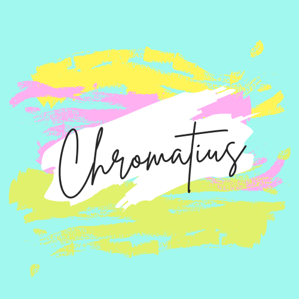

/ [Home](index.md)

# Game

## Description

- Is it possible to be patient and fast at the same time...?, well if you think it is possible then welcome to CHROMATIUS. To win this game all you have to know are few basic colors.  

- You will be given some color name in some font color. The game is to shout out the color depending on the question wether it is the word or the font color,and you will have do it with in 3 seconds.

### Reference

* [Chromatius](https://github.com/tactlabs/chromatuis)
* [Chromatius-backend](https://github.com/tactlabs/chromatuis-backend)
* [Chromatius-frontend](https://github.com/tactlabs/chromatuis-frontend)
* [Chromatius-deployment](https://github.com/tactlabs/chromatuis-deployment)
