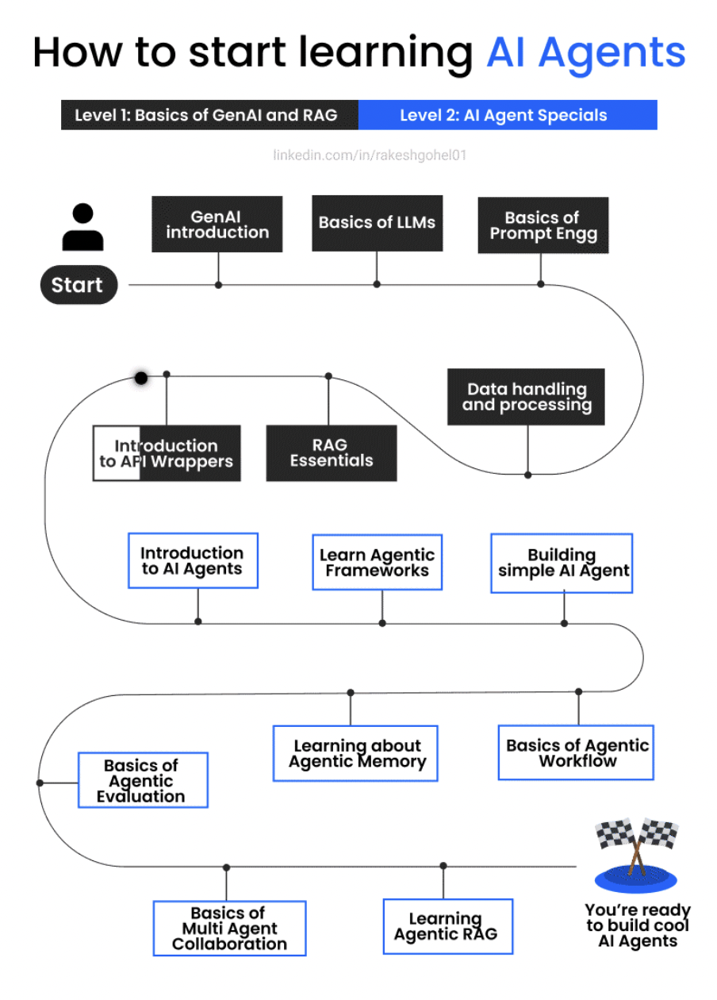

/ [Home](index.md)

## GenAI Roadmp

### Updated: Feb 19, 2025

### Level 1: Gen AI and RAG Foundations

1. Introduction to Generative AI
    - Generative AI for Everyone by Andrew Ng by DeepLearning.AI
    - [https://www.deeplearning.ai/courses/generative-ai-for-everyone/](https://www.deeplearning.ai/courses/generative-ai-for-everyone/)

2. Basics of Large Language Models (LLMs)
    - H2O ai Large Language Models (LLMs) - Level 1 by Coursera and H2O.ai
    - [https://www.coursera.org/learn/h2o-ai-large-language-models-llms-level-1](https://www.coursera.org/learn/h2o-ai-large-language-models-llms-level-1)

3. Fundamentals of Prompt Engineering
    - ChatGPT Prompt Engineering for Developers by DeepLearning.AI & OpenAI
    - [https://www.deeplearning.ai/short-courses/chatgpt-prompt-engineering-for-developers/](https://www.deeplearning.ai/short-courses/chatgpt-prompt-engineering-for-developers/)

4. Data Handling and Processing
    - Preprocessing Unstructured Data for LLM Apps by DeepLearning.AI & unstructured.io
    - [https://www.deeplearning.ai/short-courses/preprocessing-unstructured-data-for-llm-applications/](https://www.deeplearning.ai/short-courses/preprocessing-unstructured-data-for-llm-applications/)

5. Introduction to API Wrappers
    - Getting Started with Generative AI API Specialization by Coursera & Codio
    - [https://www.coursera.org/specializations/codio-generative-ai](https://www.coursera.org/specializations/codio-generative-ai)

6. Essentials of RAG
    - Introduction to Retrieval Augmented Generation (RAG) by Coursera
    - [https://www.coursera.org/learn/introduction-to-retrieval-augmented-generation-rag](https://www.coursera.org/learn/introduction-to-retrieval-augmented-generation-rag)

### Level 2: AI Agents Specialization

1. Introduction to AI Agents
    - Fundamentals of AI Agents Using RAG and LangChain by Coursera & IBM
    - [https://www.coursera.org/learn/fundamentals-of-ai-agents-using-rag-and-langchain](https://www.coursera.org/learn/fundamentals-of-ai-agents-using-rag-and-langchain)

2. Exploring Agent Frameworks
    - LangChain for LLM Application Development by DeepLearning.AI & LangChain
    - [https://www.deeplearning.ai/short-courses/langchain-for-llm-application-development/](https://www.deeplearning.ai/short-courses/langchain-for-llm-application-development/)

3. Building a Simple AI Agent
    - Build Autonomous AI Agents From Scratch With Python by Udemy
    - [https://www.udemy.com/course/build-autonomous-ai-agents-from-scratch-with-python/](https://www.udemy.com/course/build-autonomous-ai-agents-from-scratch-with-python/)

4. Understanding Agent Workflows
    - AI Agentic Design Patterns with AutoGen by Coursera & Microsoft
    - [https://www.coursera.org/projects/ai-agentic-design-patterns-with-autogen](https://www.coursera.org/projects/ai-agentic-design-patterns-with-autogen)

5. Learning About Agent Memory
    - LLMs as Operating Systems: Agent Memory by DeepLearning.AI & Letta
    - [https://www.deeplearning.ai/short-courses/llms-as-operating-systems-agent-memory/](https://www.deeplearning.ai/short-courses/llms-as-operating-systems-agent-memory/)

6. Evaluating Agent Performance
    - Building Intelligent Troubleshooting Agents by Coursera & Microsoft
    - [https://www.coursera.org/learn/building-intelligent-troubleshooting-agents](https://www.coursera.org/learn/building-intelligent-troubleshooting-agents)

7. Collaborating with Multiple Agents
    - Multi AI Agent Systems with crewAI by DeepLearning.AI & CrewAI
    - [https://www.deeplearning.ai/short-courses/multi-ai-agent-systems-with-crewai/](https://www.deeplearning.ai/short-courses/multi-ai-agent-systems-with-crewai/)

8. Implementing RAG in Agents
    - Building & Evaluating Advanced RAG Apps by DeepLearning.AI, LlamaIndex & TruEra
    - [https://www.deeplearning.ai/short-courses/building-evaluating-advanced-rag/](https://www.deeplearning.ai/short-courses/building-evaluating-advanced-rag/)
