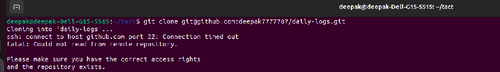

/ [Home](index.md)

## Git ssh 

### Problem

After adding ssh key to your github. You might face an error while cloning private repositories, when you give git clone, it might take longtime than usual and throws an error such as

> - Cloning into 'daily-logs'...  
    ssh: connect to host github.com port 22: Connection timed out  
    fatal: Could not read from remote repository.  
    Please make sure you have the correct access rights  
    and the repository exists.  




### Solution:

- go to your terminal

``` 
sudo nano ~/.ssh/config
```

- Then paste the below lines

```
Host github.com
 Hostname ssh.github.com
 Port 443
```
- Then click clt+x 
- enter y
- click Enter
- In your terminal paste the below command

```
ssh -T git@github.com
```
It will show a message as:  
"Hi xxx, you've successfully authenticated"  


Close your terminal, reopen it and start cloning


### Ref :

  * [git-ssh-fix-reference](https://stackoverflow.com/questions/15589682/ssh-connect-to-host-github-com-port-22-connection-timed-out)

