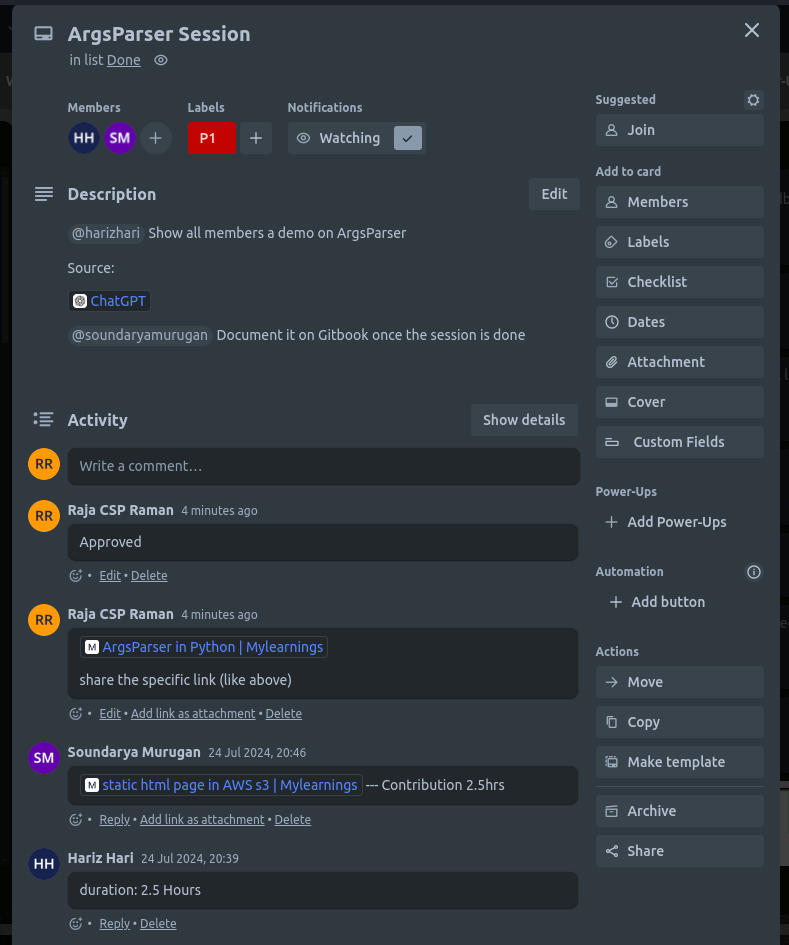

/ [Home](index.md)

## How to Document Your Learning

### How to document your learning?
- After your learning, dump them in Gitbook and then share the link in Trello
    - check [this link for Trello](https://trello.com/c/dreFsCHS/102-argsparser-session)
- Gitbook link: [gitbook](https://soundarya.gitbook.io/mylearnings/argsparser-in-python)

