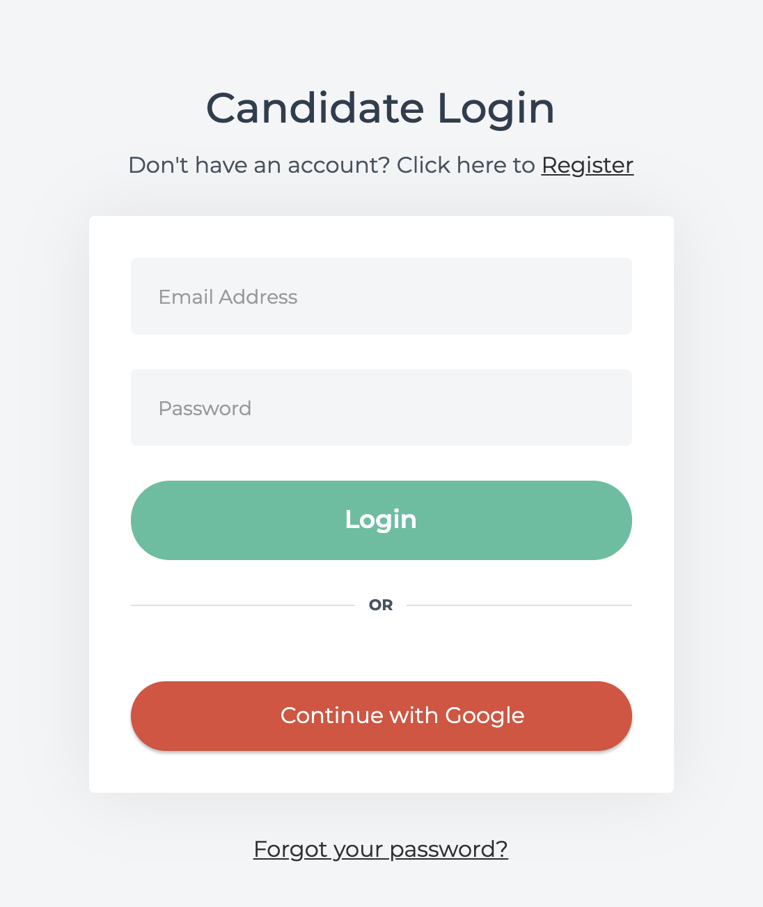
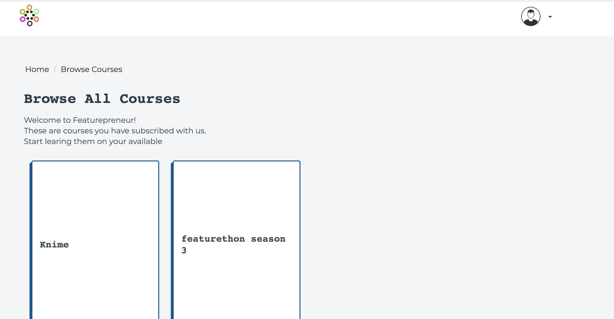
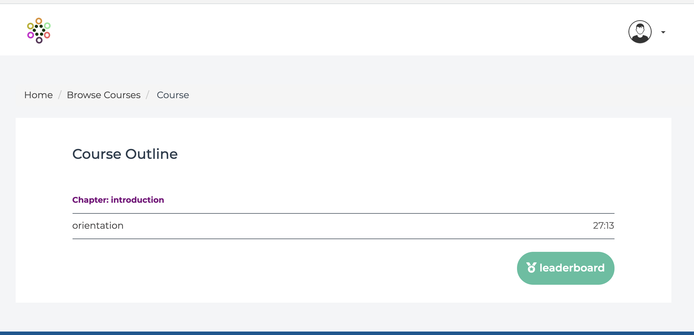

/ [Home](index.md)

# How to view courses

## Step 1:

Login to your featurepreneur account

## Step 2:

Make sure you've been subscribed to the courses. Once you've been subscribed to the required courses, go to the Menu on the top right corner.

## Step 3:

Choose the course you wish to watch

## Step 4:

Select the topic you wish to watch.

### Happy Watching!