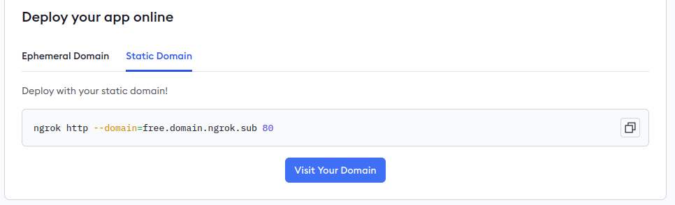

/ [Home](index.md)

## Ngrok


1. Login in on Ngrok website [https://ngrok.com/](https://ngrok.com/)

2. You can use your Gmail account to speed up the process.

3. Instruction given in this link: [https://dashboard.ngrok.com/get-started/setup/linux](https://dashboard.ngrok.com/get-started/setup/linux)


### Setup (One time)
```
snap install ngrok

ngrok config add-authtoken <yourtoken>
```

### Commands
```
# forward local
ngrok http 80

# permanent
ngrok http --domain=<check ngrok website under static domain> 80
```

### Using static domain
