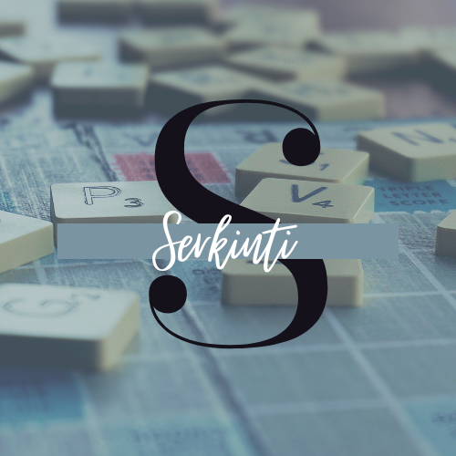

/ [Home](index.md)

# Game

* [Serkinti-API](https://github.com/tactlabs/serkinti-api)
* [Serkinti-UI](https://github.com/tactlabs/serkinti-ui)
* [Serkinti-deployment](https://github.com/tactlabs/serkinti-deployment)

## Descriptions  

- This is a really simple game with very few rules, but make sure you dont forget the rules of the game on the go. This is a two player game. 

- The game starts with any random word given by the judge, player1 should give another word related to the given word and player 2 should give a word related to player1's word. 

- You are not suppose to use shortforms or abbrivations. The loop will continue until someone breaks the rule.

