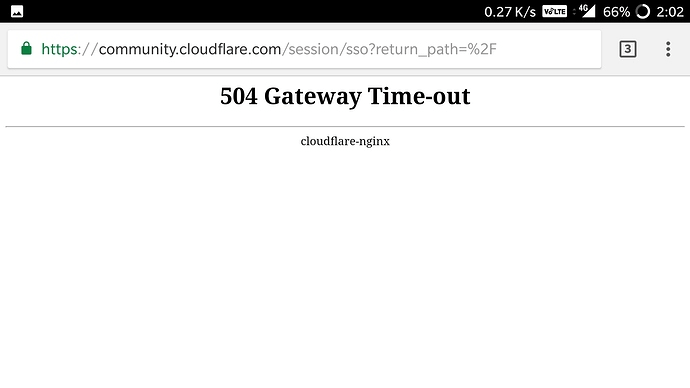
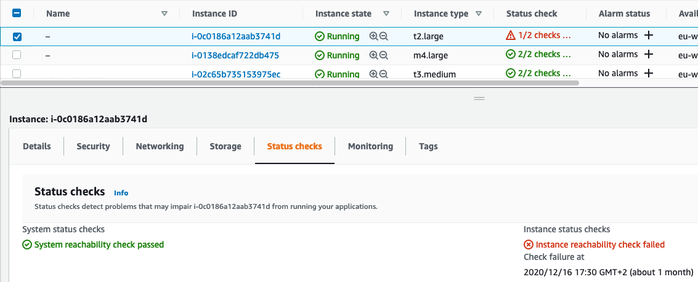

/ [Home](index.md)

# Fixing 504 Gateway Timeout Error

The 504 Gateway Timeout error is a common HTTP status code that indicates a communication problem between servers. It occurs when one server acting as a gateway or proxy does not receive a timely response from an upstream server. 



If you notice this error, while trying to reach any website that is deployed in our instance

Follow the steps below 

Go to respective EC2 instance, check for status 



- step 1: stop the instance, wait for sometime 

- step 2: start the instance, wait until it's running and statuscheck is intialized

Now to fix 404 in featurepreneur.com 

- connect to the instance, where featurepreneur is deployed

- Direct to featurepreneur-deployment 

- copy this command line 

```
sudo nohup docker-compose -f docker-compose.deploy.yml up &
```
