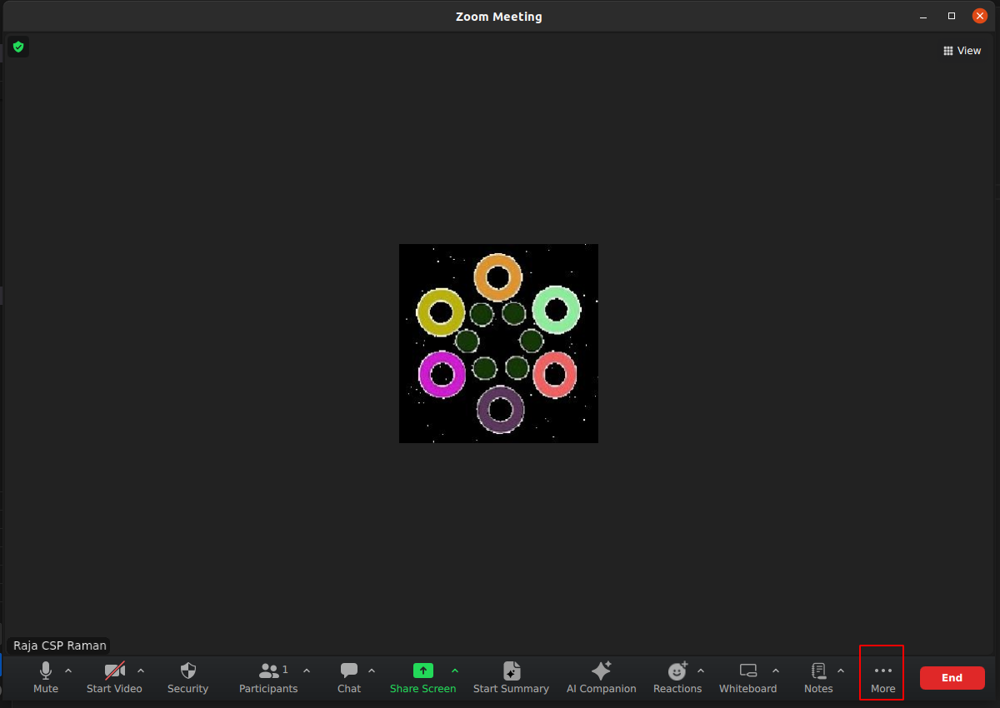
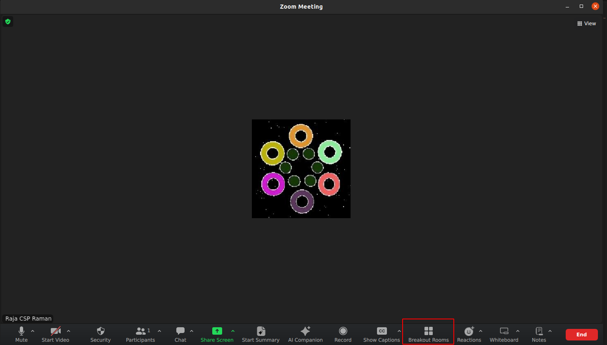
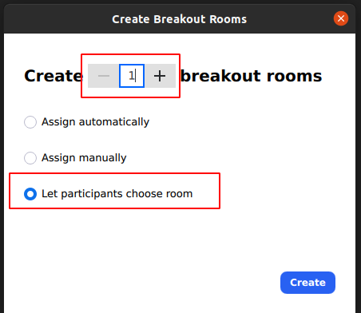
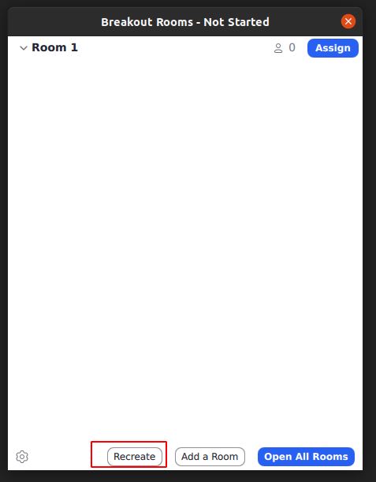
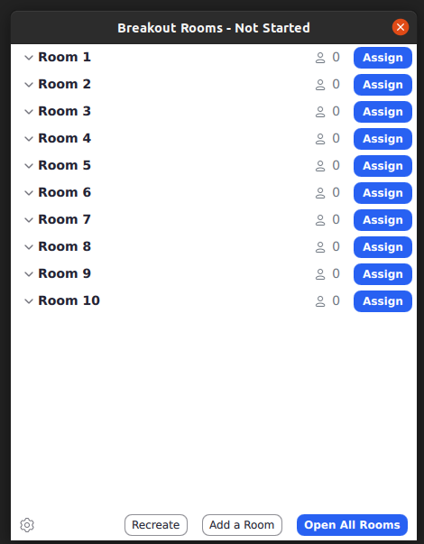
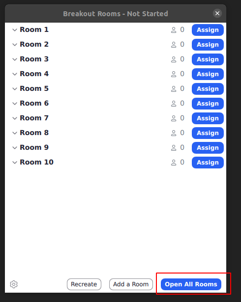

/ [Home](index.md)

# Zoom Installation


```
Uninstall Zoom client from snap:
sudo snap remove zoom-client

cd /tmp

wget --no-check-certificate https://zoom.us/client/latest/zoom_amd64.deb
	or
	curl -k -O -L https://zoom.us/client/latest/zoom_amd64.deb

sudo dpkg -i ./zoom_amd64.deb

	or
	sudo apt install gdebi
	sudo gdebi zoom_amd64.deb

if any dependency error, use this:
	sudo apt install -f
```


### How to create Rooms in Zoom?
1. Check for "Breakout rooms"

It should be either here:


Or here:


2. Choose "Let participants choose room" option



3. Increase rooms count by using + option (check screenshot above)

4. Use Recreate option to increase rooms (sometimes you come across with this)




5. You should be seeing like this:



6. Click "Open All Rooms"


7. You are done!


### Zoom Rules:
1. Do not Open or Close Breakout Rooms without authorization
2. Do not let anyone from the waiting room inside the meet unless authorized to do so
3. Announce yourself when entering any room with participants inside
4. NEVER END THE MEET unless explicitly told to do so. (Donot end the meet when other interns are working)
    host/co-host should leave the meet only after assigning host to one of the other interns working in the meet.
5. If you loggedin as admin, please log out when you leave to avoid login back conflicts

### Zoom Room Rules:
1. Every room should have a decent name (pick random topics like islands)
2. 8-20 rooms should be created
3. Private room must be there
4. Room number count should be a prime number
    ```
    Top 20 prime Numbers:
    2	3	5	7	11	13	17	19	23	29
    31	37	41	43	47	53	59	61	67	71
    ```

### Ref :

  * [https://linuxize.com/post/how-to-install-deb-packages-on-ubuntu/](https://linuxize.com/post/how-to-install-deb-packages-on-ubuntu/)
